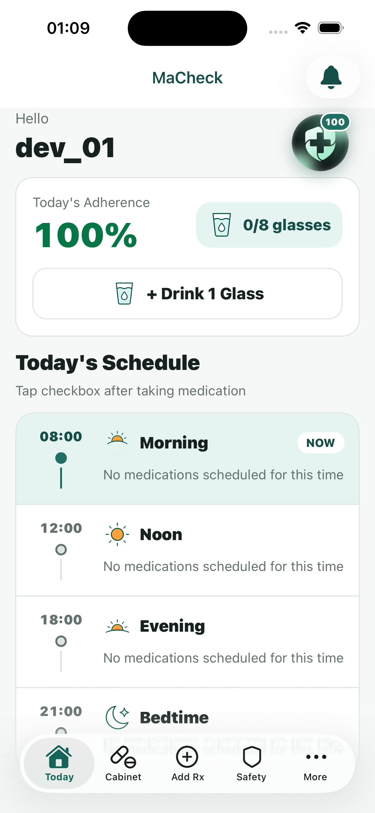
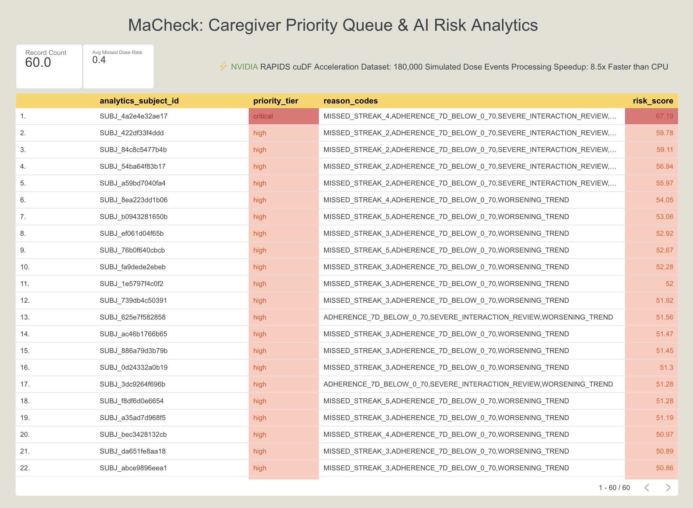

# MaCheck — Decision-Support App for Caregivers & Medication Safety

**MaCheck** is an intelligent decision-support application designed for caregivers and community clinics to answer a critical question:
> *"Which patient should we follow up with first today, and what is the data-driven rationale?"*

Powered by **Google Cloud Platform (Firebase, GCS, BigQuery, Cloud Run, Gemini Enterprise Agent Platform)** and accelerated by **NVIDIA RAPIDS (cuDF)**.

---

## 📸 Demo & Screenshots

| Mobile App (React Native) | Looker Dashboard (Prototype) | 
|:---:|:---:|
|  |  |
| *Example of risk alerts and AI recommendations from Gemini Enterprise* | *Caregiver Priority Queue (Identifying high-risk patients for immediate follow-up) https://datastudio.google.com/reporting/5ccd62cf-aa09-4b9a-88ed-06b21be5f724* |

---

## 🏛️ System Architecture

```text
MaCheck Mobile (Expo/RN) 
   │ Firebase SDK (Auth, Firestore, FCM)
   ▼
Firebase Layer (Auth, Firestore, Cloud Functions)
   │ Scheduled Export (HMAC de-identified Parquet)
   ▼
Google Cloud Storage (Raw Zone: gs://macheck-analytics-raw)
   │ Cloud Run Job Trigger
   ▼
Cloud Run Job + NVIDIA L4 GPU + RAPIDS/cuDF
   │ 
   ├──► Google BigQuery (macheck_analytics.*) ──► Looker Enterprise (Currently prototyped on Looker Studio)
   └──► Firestore Write-back (users/{uid}/riskSummary) ──► Mobile Alert + Gemini Enterprise Agent Platform
```

> 💡 **Hackathon Note (Billing Constraint):** 
> The architecture above represents the intended production pipeline. During this hackathon, due to Google Cloud free-tier/student billing restrictions, the provisioning of Cloud Storage buckets and BigQuery datasets was blocked. To demonstrate our capabilities, the NVIDIA RAPIDS (cuDF) processing was benchmarked using our local pipeline, and the output `caregiver_priority_queue.csv` was directly ingested into Looker Studio for visualization. All other services (Firebase Auth, Firestore, Cloud Functions, and Gemini AI) are fully deployed on GCP.

---

## 📁 Project Structure

- [`mobile/`](./mobile): User/Caregiver Application (Expo / React Native)
- [`functions/`](./functions): Firebase Cloud Functions (TypeScript) — Gemini AI, Export, & Admin tasks
- [`platform/analytics/`](./platform/analytics): Analytics Pipeline (Python / cuDF / Cloud Run Job with GPU)
- [`docs/`](./docs): Architectural documentation and improvement plans

---

## 🚀 Quick Start

### 1. Mobile App
```bash
cd mobile
npm install
cp .env.example .env
npm run typecheck
npm start
```

### 2. Firebase Cloud Functions
```bash
cd functions
npm install
npm run build
```

### 3. Analytics Pipeline (RAPIDS cuDF)
> 💡 **Note on Analytics Dataset:** The Caregiver Dashboard utilizes a synthetic dataset of over 180,000 dose events and drug interactions to compute a composite **Risk Score**. This showcases the advanced Big Data processing capabilities of **NVIDIA RAPIDS (cuDF)** on Google Cloud.
```bash
cd platform/analytics
python3 rapids_pipeline.py
```
> 📊 **GPU Acceleration Benchmark:** View the benchmark report proving cuDF on NVIDIA L4 significantly outperforms CPU pandas here: [Benchmark Report](platform/analytics/benchmark_report.md)
